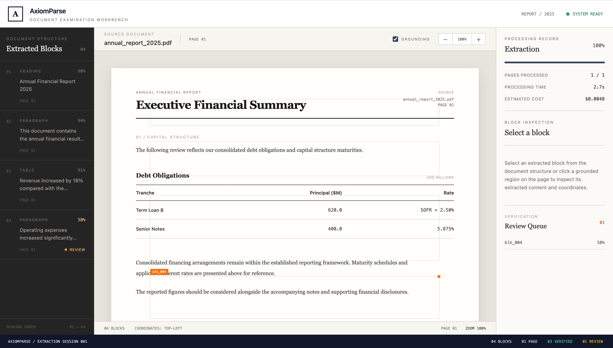

# AxiomParse

> **DOCUMENT EXAMINATION WORKBENCH**

AxiomParse is a modular document examination and processing system designed to transform input documents into structured, reviewable information.

The project is organized into separate frontend, backend, parsing and processing, smart-contract, testing, and supporting asset components.

---

## Overview

AxiomParse provides an interface for examining processed document content and presenting extracted information in a structured format.

The system is designed around a modular architecture so that individual components can be developed, tested, and extended independently.

Key areas of the project include:

- Document examination and processing
- Structured extraction of document content
- Frontend-based result visualization
- Backend application processing
- Smart-contract components
- Automated testing infrastructure
- Demonstration and supporting assets

---

## Problem Statement

Processing documents manually can make it difficult to identify, organize, and review different types of content efficiently.

AxiomParse aims to provide a structured application environment where document information can be processed and presented as identifiable blocks such as headings, paragraphs, tables, and other extracted content.

The system is designed to improve organization, reviewability, and extensibility of document-processing workflows.

---

## Objectives

The main objectives of AxiomParse are:

- Provide a structured document examination interface.
- Process input documents into organized content.
- Present extracted information in a clear format.
- Support review and inspection of processed content.
- Maintain separate frontend and backend components.
- Provide a dedicated location for smart-contract functionality.
- Maintain a testing structure for reliable development.
- Keep the system modular and extensible.

---

## Key Features

### Document Examination

AxiomParse provides a document examination interface for viewing processed document information.

### Structured Extraction

Processed document content can be represented as structured blocks such as:

- Headings
- Paragraphs
- Tables
- Other document elements

### Confidence and Processing Information

The interface can present processing-related information such as extraction confidence, processing status, pages processed, processing time, and estimated processing information.

### Block Inspection

Individual extracted blocks can be inspected to support document review and verification.

### Modular Architecture

The repository separates the major components into:

- Frontend
- Backend
- Processing
- Smart contracts
- Tests
- Demo assets

### Smart-Contract Components

Blockchain-related components are maintained separately inside the `contracts/` directory.

---

## System Architecture

```text
                         ┌──────────────────────┐
                         │        User          │
                         └──────────┬───────────┘
                                    │
                                    ▼
                         ┌──────────────────────┐
                         │      Frontend        │
                         │   User Interface     │
                         └──────────┬───────────┘
                                    │
                                    ▼
                         ┌──────────────────────┐
                         │       Backend        │
                         │ Application Logic    │
                         │   & Processing       │
                         └──────────┬───────────┘
                                    │
                         ┌──────────┴───────────┐
                         │                      │
                         ▼                      ▼
              ┌──────────────────┐   ┌──────────────────┐
              │ Parsing & Data   │   │ Smart Contracts  │
              │ Processing       │   │ / Blockchain     │
              └────────┬─────────┘   └────────┬─────────┘
                       │                      │
                       └──────────┬───────────┘
                                  ▼
                         ┌──────────────────────┐
                         │   Processed Output   │
                         └──────────┬───────────┘
                                    │
                                    ▼
                         ┌──────────────────────┐
                         │      Frontend        │
                         │  Results / Review    │
                         └──────────────────────┘
```

The architecture follows a separation-of-concerns approach in which the frontend, backend, processing logic, smart contracts, and tests are maintained as distinct project areas.

---

## Application Workflow

```text
User
 │
 ▼
Frontend
 │
 │ Input / Document
 ▼
Backend
 │
 ▼
Parsing & Processing
 │
 ├──────────────► Smart Contract Layer
 │
 ▼
Structured / Processed Results
 │
 ▼
Frontend
 │
 ▼
User Review / Output
```

The frontend provides the primary interaction layer, while the backend coordinates application-level processing.

The processing layer transforms input into structured information that can be presented to the user.

---

## Repository Structure

```text
axiom-parser/
│
├── backend/
│   └── Backend application and processing components
│
├── contracts/
│   └── Smart-contract components
│
├── demo_assets/
│   └── Demonstration and supporting assets
│
├── frontend/
│   └── Frontend application
│
├── tests/
│   └── Testing components
│
├── .gitignore
├── README.md
├── axiom_parser.jpg
├── generate_assets.py
├── package.json
└── package-lock.json
```

---

## Technology Stack

## Technology Stack

### Frontend

- React 19
- TypeScript
- Vite 8
- Tailwind CSS 4
- React DOM
- ESLint

### Project Structure

- Frontend application in `frontend/`
- Backend components in `backend/`
- Smart contracts in `contracts/`
- Testing components in `tests/`
- Demonstration assets in `demo_assets/`

### Development Tools

- Node.js
- npm
- Git
- GitHub
## Screenshots

### AxiomParse Document Examination Dashboard



The dashboard provides a document examination workspace with extracted blocks, processing information, confidence values, and review-related functionality.

---

## Project Components

### Frontend

The `frontend/` directory contains the user-facing application.

It provides the interface through which users interact with AxiomParse and view processed document information.

### Backend

The `backend/` directory contains server-side application components and processing logic.

### Contracts

The `contracts/` directory contains smart-contract components associated with the project.

### Tests

The `tests/` directory contains testing-related project components.

### Demo Assets

The `demo_assets/` directory contains supporting assets used for demonstration and development.

### Asset Generation

The `generate_assets.py` script is used to generate supporting project assets.

---

## Design Principles

AxiomParse follows these architectural principles:

### Modularity

Major components are maintained in separate directories to simplify development and maintenance.

### Separation of Concerns

Frontend, backend, processing, smart-contract, and testing responsibilities are kept as distinct project areas.

### Maintainability

The repository structure makes individual components easier to locate, modify, and extend.

### Extensibility

The architecture allows additional document-processing capabilities, input formats, integrations, and application features to be introduced over time.

### Testability

Testing is maintained as a dedicated project area to support reliable development.

---

## Getting Started

### Prerequisites

Make sure the following are installed:

- Node.js
- npm
- Git

### Clone the Repository

```bash
git clone https://github.com/shreedevi-s-28/axiom-parser.git
cd axiom-parser
```

### Install Project Dependencies

```bash
npm install
```

Additional dependencies may be required for individual components located inside the `frontend/`, `backend/`, `contracts/`, or `tests/` directories.

Refer to the respective component configuration files for component-specific setup.

---

## Running the Application

AxiomParse analyses real PDFs: the frontend uploads the selected file to the backend, the backend runs the extraction pipeline, and the UI renders what comes back. Nothing is mocked.

Requirements: Python 3.11+ and Node.js 20+.

**1. Backend** (terminal 1, serves `http://localhost:8000`)

```bash
cd backend
python3 -m venv .venv && source .venv/bin/activate
pip install -r requirements.txt
python -m uvicorn app.main:app --port 8000
```

**2. Frontend** (terminal 2, serves `http://localhost:5173`)

```bash
cd frontend
npm install
npm run dev
```

Open `http://localhost:5173`, choose **Select PDF**, then **Analyze**. Sample PDFs are in `demo_assets/` (for example `merger_filing_q3.pdf`).

**API**

| Endpoint | Purpose |
| --- | --- |
| `POST /api/v1/parse` | Multipart upload (`file` field). Returns blocks, page geometry and metrics as JSON, or an RFC 7807 error. |
| `GET /api/v1/documents/{document_id}/pages/{page}/image` | PNG of one page of an analysed PDF, used for the page preview. |
| `GET /api/v1/health` | Liveness check. |

**Configuration (optional)**

| Variable | Default | Meaning |
| --- | --- | --- |
| `VITE_API_BASE_URL` (frontend) | `http://localhost:8000` | Where the frontend finds the backend. |
| `AXIOMPARSE_CORS_ORIGINS` (backend) | `http://localhost:5173,http://127.0.0.1:5173` | Comma-separated origins allowed to call the API. |
| `AXIOMPARSE_MAX_UPLOAD_MB` (backend) | `50` | Upload size limit. |
| `AXIOMPARSE_DEMO_CACHE` (backend) | off | Set to `1` to serve pre-computed results for known files. Leave off for real analysis. |

**Tests**

```bash
python -m pytest tests -q          # backend (from the repository root)
cd frontend && npm run lint && npm run build
```

Notes: `confidence` is `null` for PDFs because text is read from the PDF text layer and no OCR runs. Scanned or image-only PDFs are rejected with a clear error.

---

## Development

AxiomParse is organized to allow different project components to be developed independently.

Typical development areas include:

* Frontend interface development
* Backend processing
* Document parsing and extraction
* Smart-contract development
* Automated testing
* Demo asset generation

As the project evolves, component-specific development instructions can be added to this documentation.

---

## Testing

Testing resources are maintained in the `tests/` directory.

The testing structure can be expanded as additional frontend, backend, processing, and smart-contract functionality is implemented.

---

## Future Scope

Potential future improvements include:

* Support for additional document formats.
* Improved document parsing and extraction.
* Advanced document analysis.
* Enhanced frontend visualization.
* Improved review and verification workflows.
* Additional backend validation.
* Expanded smart-contract integration.
* Increased automated test coverage.
* Performance and scalability improvements.
* Production deployment.
* Monitoring and logging capabilities.

---

## Project Status

AxiomParse is an actively developed project.

The architecture and functionality may evolve as additional processing capabilities, integrations, testing, and deployment features are implemented.

---

## License

This project is licensed under the MIT License. See the [LICENSE](LICENSE) file for details.

---

## Repository

GitHub: [https://github.com/shreedevi-s-28/axiom-parser](https://github.com/shreedevi-s-28/axiom-parser)

---

## Author

**Shree Devi S**

GitHub: [https://github.com/shreedevi-s-28](https://github.com/shreedevi-s-28)
